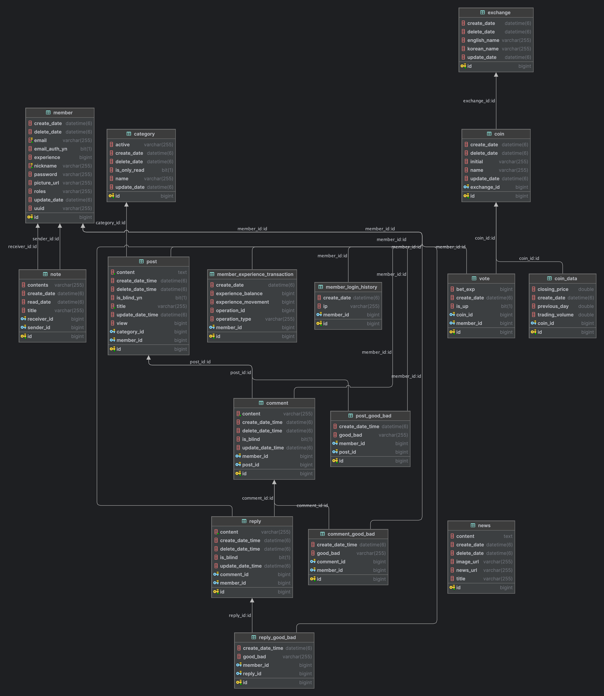

# 🐮 카우톡(Cowtalk)

### 주제

가상화폐의 상승 또는 하락을 투표하고 경험치를 배팅하며 토론할 수 있는 커뮤니티 서비스입니다.

### Tech Stack

 
   
   
   
  

## 프로젝트 기능 및 설계

- 회원가입 기능
    - 이메일, 패스워드, 닉네임을 입력받아 회원가입합니다.
    - 이메일로 인증 코드를 전송합니다.
    - 이메일과 닉네임은 고유해야 합니다.
    - 네이버, 카카오, 구글 계정으로도 가입할 수 있습니다. (OAuth2 활용)

- 로그인 기능
    - 회원가입 시 입력한 이메일과 패스워드로 로그인합니다.
    - 인증된 회원만 로그인할 수 있습니다.
    - 네이버, 카카오, 구글 계정으로도 로그인할 수 있습니다. (OAuth2 활용)
    - 로그인 기록(이메일, IP 주소, 로그인 일자)이 저장됩니다.
    - JWT 토큰을 사용합니다.

- 회원정보 관리 기능
    - 이메일, 패스워드, 닉네임, 프로필 사진을 조회하고 변경할 수 있습니다. (Amazon S3를 사용하여 이미지 스토리지)
    - 한 달에 한 번씩만 이메일과 닉네임을 변경할 수 있습니다.
    - 작성한 게시글과 쪽지함을 조회할 수 있습니다.
    - Transaction Table에 회원의 경험치 기록이 저장됩니다.

- 쪽지 기능
    - 로그인한 사용자는 권한에 관계 없이 쪽지를 작성할 수 있습니다.
    - 쪽지 제목과 내용을 작성하고 다른 사용자의 닉네임으로 보낼 수 있습니다.
    - 다른 사용자로부터 쪽지를 받을 수 있으며 도착 시 알림이 표시됩니다. (WebSocket 활용)

- 커뮤니티 기능
    - 가상화폐: 업비트와 빗썸의 가상화폐 정보를 확인합니다.
    - 뉴스: 크롤링하여 Coinness 사이트의 뉴스 정보를 가져옵니다.
    - 토론방: 게시판 형태로 토론 및 글 작성이 가능합니다.
        - 인기글을 확인할 수 있습니다.
            - 일, 주, 월별로 섹션이 나눠집니다.
            - 좋아요, 조회수 순으로 확인할 수 있습니다.

- 게시글 작성 및 관리 기능
    - 로그인한 사용자는 권한에 관계 없이 글을 작성할 수 있습니다.
    - 게시글 제목과 내용을 작성하고 본인의 글은 수정 및 삭제가 가능합니다.
        - 수정할 경우 수정된 게시글이라는 문구가 출력됩니다.
        - 삭제할 경우 삭제된 게시글이라는 문구가 출력되며, 해당 게시글로 얻게된 경험치 또한 회수됩니다.
    - 조회수 중복이 방지됩니다. (Redis와 Scheduler 활용)

- 댓글 작성 및 관리 기능
    - 로그인한 사용자는 권한에 관계 없이 댓글을 작성할 수 있습니다.
    - 댓글 내용은 수정 및 삭제가 가능하며 본인의 댓글만 수정/삭제할 수 있습니다.
        - 수정할 경우 수정된 댓글이라는 문구가 출력됩니다.
        - 삭제할 경우 삭제된 댓글이라는 문구가 출력되며, 해당 댓글로 얻게된 경험치 또한 회수됩니다.
    - 대댓글을 작성할 수 있습니다.

- 검색 기능
    - 가상화폐 종목명, 게시글 제목 및 작성자 닉네임으로 검색 가능합니다. (Elastic Search 활용)

- 좋아요 및 싫어요 기능
    - 게시글 또는 댓글에 좋아요와 싫어요를 선택 할 수 있습니다. (선택 후 번복불가)
    - 싫어요 선택 시 경험치 감소(10점), 일정 개수 도달 시 자동으로 해당 글/댓글은 숨김처리 됩니다.
    - 숨김처리 기록(작성자 고유 번호, 내용, 숨김 처리 일자)이 저장됩니다.

- 투표 및 배팅 기능
    - 로그인한 사용자는 권한에 관계 없이 특정 가상화폐의 상승 및 하락을 투표하고 배팅할 수 있습니다.
    - 한 종목당 하루에 한 번만 투표 가능하며, 번복 불가능합니다.
    - 배팅 성공시 경험치 획득 예시는 다음과 같습니다.
        - A가 10, B가 20, C가 30을 배팅한다고 가정하면, 맞춘 사람들은 자신이 배팅한 수치의 비율에 따라 보상을 받습니다.
        - C가 맞췄다고 가정하면 (30 / 60) * 60 = 30 경험치를 추가로 받습니다.
    - Transaction Table에 배팅 경험치 기록이 저장됩니다.

- 가상화폐 기능
    - 외부 API를 이용해서 가상화폐의 데이터를 조회합니다.
        - CoinGecko(https://www.coingecko.com/en/api/documentation)
    - 업비트/빗썸에 상장된 가상화폐의 데이터는 MySQL에 모두 저장됩니다. (Spring Batch 활용)
        - 일자, 종가(KRW), 전일대비, 거래량(KRW)
    - 새로 상장 또는 폐지된 코인을 확인하기 위해 주기적으로 업데이트 로직이 실행됩니다. (Scheduler 활용)

- 뉴스 기능
    - Coinness(https://coinness.com/) 사이트에서 크롤링 작업이 진행됩니다.
        - 제목, 내용, 메인 사진 URL, 뉴스 URL, 작성일자
    - 새로 작성 또는 삭제된 뉴스를 확인하기 위해 주기적으로 업데이트 로직이 실행됩니다. (Scheduler 활용)

## ERD

## API 명세서

[바로보기](doc/API.md)

## Trouble Shooting

[바로보기](doc/TROUBLE_SHOOTING.md)
